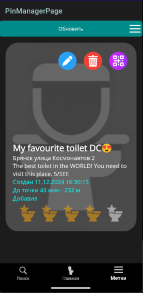

# It is Your Shick

### Приложение, созданное для отслеживания и категоризации ближайших толчков
---
Из возможностей:

* Возможность оставлять метки и отзывы о прошедшем опыте
* Рейтинг туалетов по пятибальной шкале
* Все данные хранятся локально и доступны всегда

<table>
  <tr>
    <td></td>
    <td></td>
  </tr>
  <tr>
    <td>Интерфейс приложения</td>
    <td>Рейтинг туалетов</td>
  </tr>
   <tr>
        <td></td>
        <td></td>
    </tr>
    <tr>
        <td>Просмотр созданных туалетов с разных устройств</td>
        <td>Синхронизация с сервером (заглушки)</td>
    </tr>
</table>

Stack: C#, .NET MAUI, SQLite, ASP.NET Core

